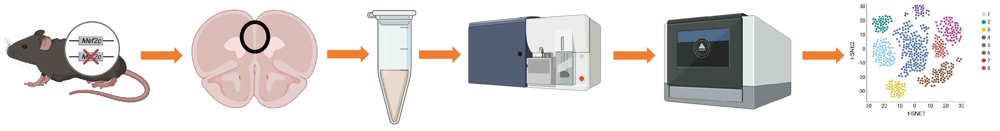

MEF2C hypofunction in GABAergic cells alters neurotypical behavior and prefrontal cortex inhibitory synaptic transmission in a sex-dependent manner
==========================

This repository contains analysis code for the single nuclei RNA-seq project carried out by researchers at the [Cowan lab, MUSC](https://medicine.musc.edu/departments/neuroscience/research/cowan) and [Berto Lab, MUSC](https://bertolab.org/)

## Cite this

If you use anything in this repository please cite the following publication:

Pre-print URL:  
https://www.sciencedirect.com/science/article/pii/S2667174324000028

## Access the data with an app:

Here a webapp to analyze the data: 
[Mef2c het GABA effect](https://bioinformatics-musc.shinyapps.io/Cho_PFC_Mef2cHet/)

## Files

| directory | contents | code |
| --------- | -------- | -------- |
| [`input`](input/) | Input/Output data of the initial processing and quality check. | 01_Downstream_Analysis_SCT.r|
| [`output`](output/) | Output data of the initial clustering and integration. | 01_Downstream_Analysis_SCT.r \ 02_Doubletting.r \ 03_Markers_Detection.r|
| [`output_reclust`](output_reclust/) | Output data of the reclustering and subset analyses. | 04_Relabel_And_InitialViz.r \ 05_DGE_Libra_LinearMixed.r \ 07_DGE_visualizations.R \ 09_Database.R \ 10_Motif_Enrichment_scRNA.R|
| [`output_Figure1`](output_Figure1/) | Output for figures and additional visualizations. | 07_DGE_visualizations.R \ 08_GeneOntology.R|
| [`output_SCENIC`](output_SCENIC/) | Output data of the Regulome analyses. | 11_Prepare_Scenic.R \ 12_Analyze_Scenic.R|
| [`output_hdWGCNA`](output_hdWGCNA/) | Output data of the Coexpression analyses. | 13_hdWGCNA.R|
| [`shinyApp`](shinyApp/) | Output of the ShinyApp. | 14_ShinyApp.r|
